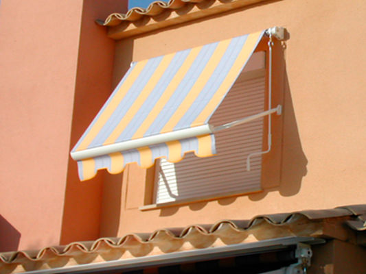
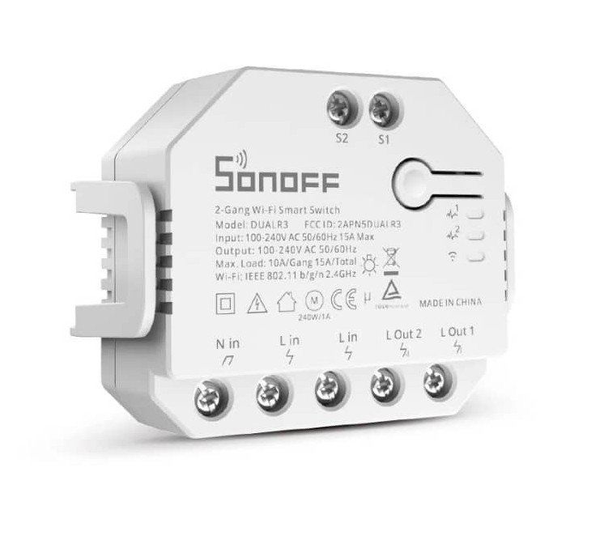

Awning Cover
============

.. seo::
    :description: Instructions for setting up position-controlled awnings with calibration capabilities in ESPHome.
    :image: blinds.svg

The ``awning`` cover platform allows you to create position-controlled awnings with built-in position tracking
and calibration capabilities. This component uses a non-linear position-to-angle transformation to accurately
represent the awning's real movement, making it ideal for motorized awnings where the movement is not linear
relative to the opening angle.

    
    Example of an articulated arm awning where movement is not linear relative to the opening angle

    
    Example of a typical awning controller with up/down relays

.. code-block:: yaml

    # Example configuration entry
    binary_sensor:
      - platform: gpio
        pin:
            number: 5
            mode:
                input: true
                pullup: true
            inverted: true
        name: "push down"
        id: "push_down"
        on_press:
            then:
                - cover.close: "WindowAwning"
        on_release:
            then:
                - cover.stop: "WindowAwning"
      - platform: gpio
        pin:
            number: 4
            mode:
                input: true
                pullup: true
            inverted: true
        name: "push up"
        id: "push_up"
        on_press:
            then:
              - cover.open: "WindowAwning"
        on_release:
            then:
              - cover.stop: "WindowAwning"
    
    output:
      - platform: gpio
        pin: 14
        id: open_relay
      - platform: gpio
        pin: 12
        id: close_relay

    cover:
      - platform: awning
        name: "WindowAwning"
        
        # Required: Duration settings
        open_duration: 30s
        close_duration: 30s
        
        # Required: Actions for movement control
        open_action:
          - switch.turn_on: open_relay
        close_action:
          - switch.turn_on: close_relay
        stop_action:
          - switch.turn_off: open_relay
          - switch.turn_off: close_relay
          
        # Optional: Calibration settings
        calibration:
          enabled: true
          reset_sequence:
            - stop
            - down
            - stop
          up_sequence:
            - up
            - stop
          down_sequence:
            - down
            - stop
          pulse_pause: 250ms
          final_pause: 2500ms

Configuration variables:
------------------------

- **open_duration** (**Required**, :ref:`config-time`): The amount of time it takes for the awning
  to open completely from the fully-closed position.

- **close_duration** (**Required**, :ref:`config-time`): The amount of time it takes for the awning
  to close completely from the fully-open position.

- **open_action** (**Required**, :ref:`Action <config-action>`): The action to execute when opening
  the awning.

- **close_action** (**Required**, :ref:`Action <config-action>`): The action to execute when closing
  the awning.

- **stop_action** (**Required**, :ref:`Action <config-action>`): The action to execute when stopping
  the awning, either by request or when reaching the target position.

- **has_built_in_endstop** (*Optional*, boolean): Indicates if the awning has built-in endstop sensors.
  When enabled, the ``stop_action`` won't be executed when reaching open/close positions. Defaults to ``false``.

- **assumed_state** (*Optional*, boolean): Whether the true state of the cover is not known.
  Enables both OPEN and CLOSE buttons in Home Assistant when true. Defaults to ``true``.

- **calibration** (*Optional*): Configuration options for motor calibration features.

  - **enabled** (*Optional*, boolean): Enable/disable calibration capabilities. Defaults to ``true``.
  - **reset_sequence** (*Optional*, list): Sequence of actions for resetting calibration. Each action can be
    ``up``, ``down`` or ``stop``. Defaults to empty list.
  - **up_sequence** (*Optional*, list): Sequence for setting upper limit. Defaults to empty list.
  - **down_sequence** (*Optional*, list): Sequence for setting lower limit. Defaults to empty list.
  - **pulse_pause** (*Optional*, :ref:`config-time`): Pause between calibration actions. Defaults to ``250ms``.
  - **final_pause** (*Optional*, :ref:`config-time`): Final pause after calibration sequence. Defaults to ``2500ms``.

- All other options from :ref:`Cover <config-cover>`.

Calibration Automation:
------------------------

The awning component supports calibration through automations. You can trigger calibration sequences using
the ``awning.calibrate`` action:

.. code-block:: yaml

    # Example automation for calibration
    button:
      - platform: template
        name: "Reset Calibration"
        on_press:
          - awning.calibrate:
              id: my_awning
              action: reset

    # Valid calibration actions are:
    # - reset: Execute reset sequence
    # - up: Execute upper limit calibration
    # - down: Execute lower limit calibration

Position Control:
------------------------

The awning uses a non-linear position-to-angle transformation to accurately represent the awning's movement.
This means that the position reported (0.0-1.0) corresponds to the actual opening angle rather than the linear
motor movement. This is especially useful for awnings where the relationship between motor movement and opening
angle is not linear.

See Also
--------

- :doc:`index`
- :doc:`time_based`
- :ref:`automation`
- :apiref:`awning/awning_cover.h`
- :ghedit:`Edit`
